## Part 1. Установка ОС
- Вывод команды `cat /etc/issue`

## Part 2. Создание пользователя
- Был создан пользователь `user-1`, вывод команды `cat /etc/passwd`

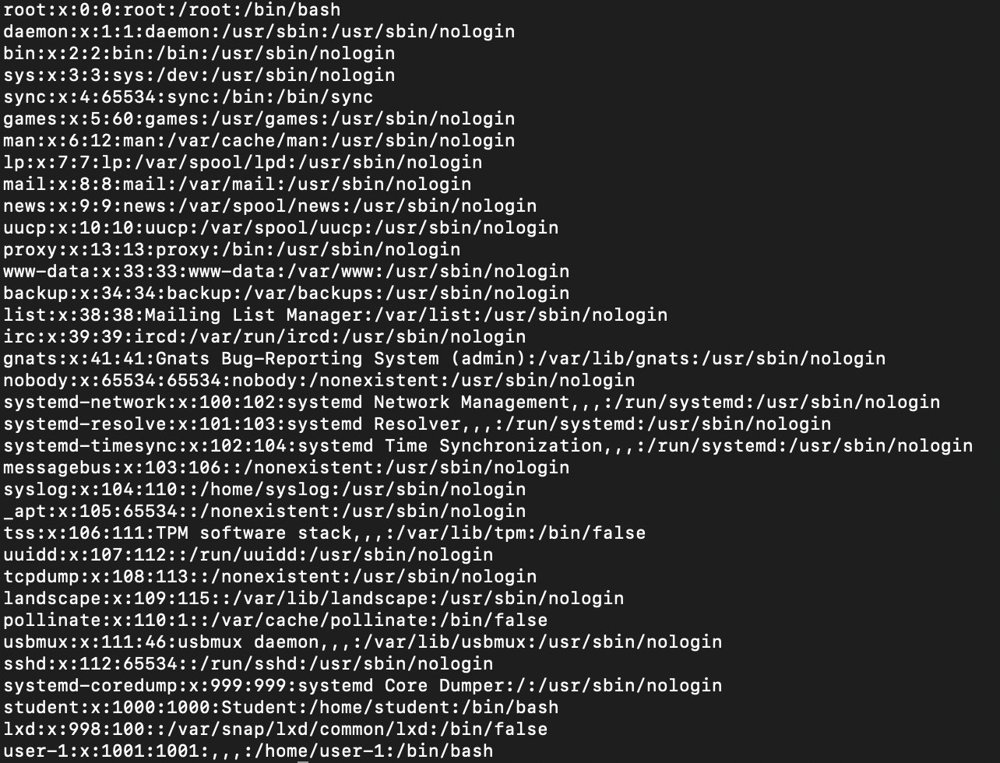

- Добавлен в группу `adm`, вывод команды `cat /etc/group | grep user-1`

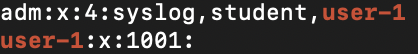

## Part 3. Настройка сети ОС

- Изменил название машины на `user-1` в VirtualBox менеджере
- Проверить настройки времени/даты `timedatectl`
- Открыть список временных зон `timedatectl list-timezones | less`
- Установить Новосибирское время `sudo timedatectl set-timezone Asia/Novosibirsk`

- lo (loopback device) – виртуальный интерфейс, присутствующий по умолчанию в любом Linux. Он используется для отладки сетевых программ и запуска серверных приложений на локальной машине. С этим интерфейсом всегда связан адрес 127.0.0.1. У него есть dns-имя – localhost. Посмотреть привязку можно в файле /etc/hosts.

- мой ip `10.0.2.15`

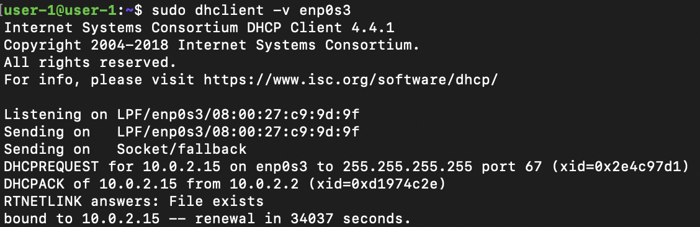

По умолчанию большинство сервисов стартует на localhost либо в документации предлагают стартовать на нём. На это есть 2 причины. По умолчанию это безопасно. Сервис, запущенный на одном интерфейсе, недоступен с другого. То есть при таком запуске сервис занимает порт на адресе 127.0.0.1, но порт на интерфейсе eth0 остается свободным, а значит снаружи до него не достучаться.

- DHCP - это клиент-серверный протокол динамической конфигурации хоста (Dynamic Host Configuration Protocol), с помощью которого в ИТ-инфраструктуре сетевые параметры каждого нового устройства прописываются автоматически.

- Внутренний IP-адрес шлюза, он же ip-адрес по умолчанию (gw) `10.0.2.2`, получен в выводе команды `ip route`

- Внешний ip-адрес шлюза `178.23.151.201` получен в выводе команды `curl ifconfig.me/ip` 

- Задал статичные настройки в файле `/etc/netplan/00-installer-config.yaml`

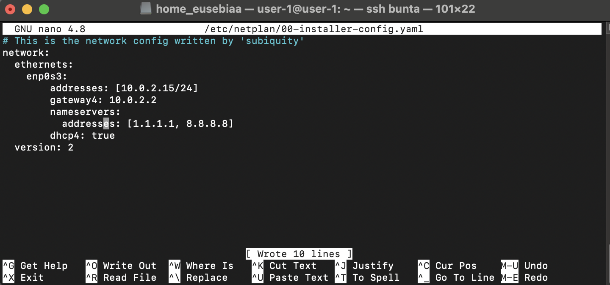

- Применить настройки `sudo netplan apply`, проверка на соответствие настроек

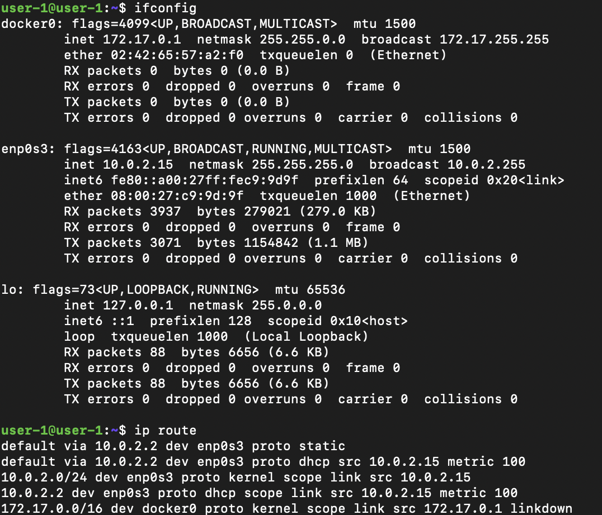

- Проверка пингованием удаленных хостов 1.1.1.1 и ya.ruы

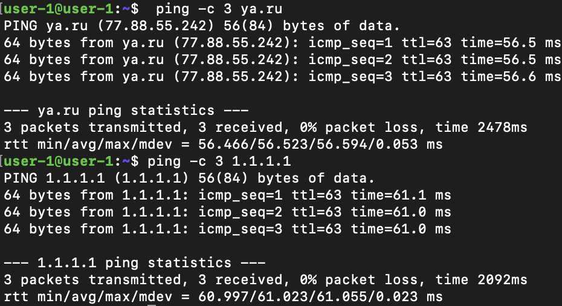

## Part 4. Обновление ОС

- Обновление списка актуальными пакетами `sudo apt update`
- Установка обновление `sudo apt upgrade`

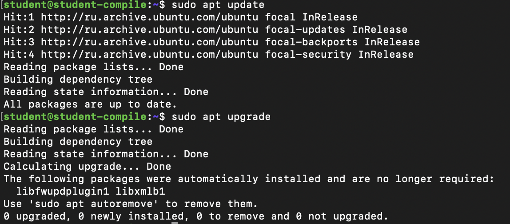

## Part 5. Использование команды **sudo**

- **sudo** позволяет пользователю выполнять команду в качестве суперпользователя или другого пользователя, согласно указанным настройкам безопасности.

- изменил hostname `student-compile` на `kirka`

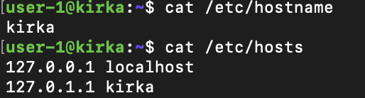

## Part 6. Установка и настройка службы времени

- вывод команды `timedatectl show`

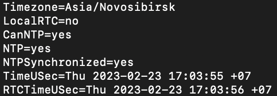

## Part 7. Установка и использование текстовых редакторов

### **VIM**
- **редактирование** -> `vim test_VIM.txt` -> перейти в режим редактирования нажатием на `I` -> вставить текст -> для выхода из режима нажать `ESC` -> сочетание клавиш для открытия консоли `shift + :` -> для выхода с сохранением написать `:wq` || для выхода без сохранения `:q!`

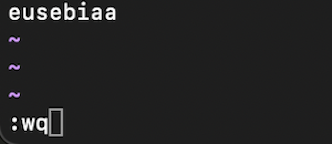

- **поиск слова** -> нажать `/` -> в консоль вписать шаблон -> чтобы перейти к следующему совпадению нажать `n`

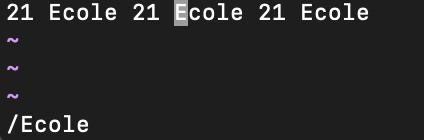

- **поиск и замена** -> в консоль вписывается шаблон `:[range]s/{pattern}/{string}/[flags] [count]`. Команда ищет в каждой строке в [range] {pattern} и заменяет его {string} . [count] — положительное целое число, умножающее команду.
Если не [range] и [count] , заменяется только шаблон, найденный в текущей строке. Текущая строка — это строка, в которой находится курсор.

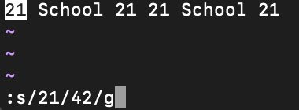
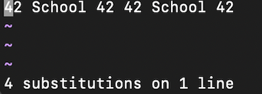

### **NANO**

- **редактирование** -> `nano test_NANO.txt` -> вписать текст -> сохранить `ctrl + o`, нажать `enter` -> выйти `ctrl + x` -> если изменения не были сохранены, спросит о нём. Выбрать ответ прописав соответствующую команду

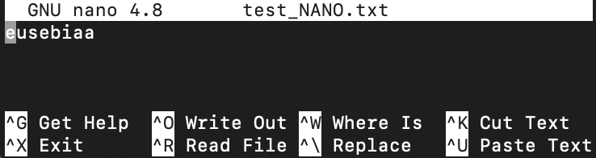
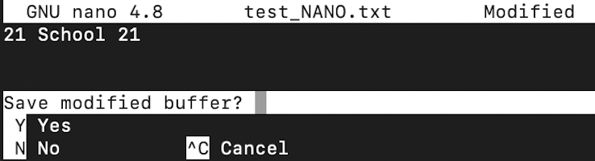

- **поиск слова** -> нажать `ctrl + w`, ввести слово для поиска -> `enter` -> для перехода на следующее совпадение `alt + w`

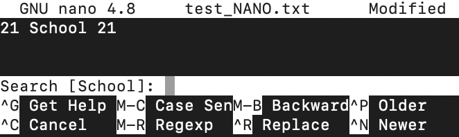

- **поиск и замена** -> нажать `ctrl + \` -> ввести строку для поиска -> ввести строку для замены -> подтвердить вставку

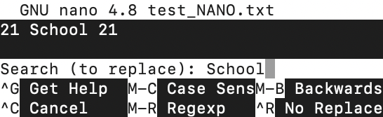
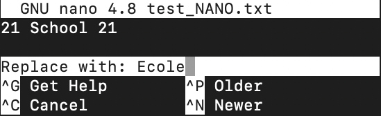
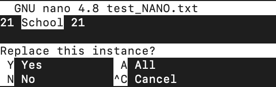
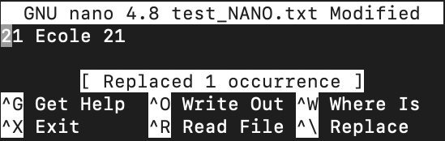

### **JOE**

- **редактирование** -> `joe test_JOE.txt` -> вписать текст -> сохранить и выйти `ctrl + k + x` -> для выхода без сохранения `ctrl + k + q` и отазаться от сохранения

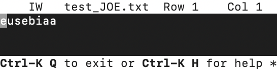
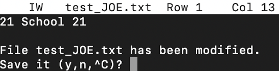

- **поиск слова** -> установить курсор в начале -> нажать `ctrl + k + f` -> ввести шаблон для поиска -> `enter`

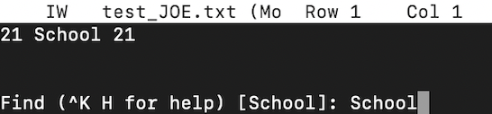

- **поиск и замена** -> установить курсор в начале -> нажать `ctrl + k + f` -> ввести шаблон для поиска -> `enter` -> выбрать флаг `r` -> ввести шаблон на замену -> `enter`

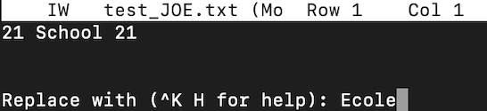
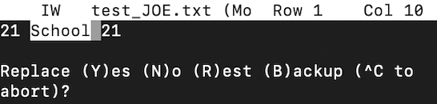
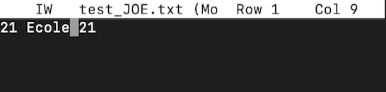

## Part 8. Установка и базовая настройка сервиса **SSHD**

- установить службу SSHd `sudo apt-get install ssh`
- установить OpenSSH `sudo apt install openssh-server`
- добавить автостарт службы `sudo systemctl enable sshd`
- проверить работу службы `systemctl status sshd`
- открыть конфигурационный файл `sudo nano /etc/ssh/sshd_config`, изменить порт на 2022
- для вступления измений необходимо перезапустить SSH-сервер `systemctl restart sshd`
- для вывода процесса `sshd` через `ps`, использовал флаг `-С` поиск по названию процесса

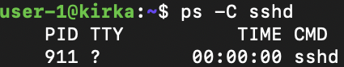

- **-t** - Отображать TCP подключения
- **-a** - Показывать состояние всех сокетов; обычно сокеты, используемые серверными процессами, не показываются.
- **-n** - Показывать сетевые адреса как числа. netstat обычно показывает адреса как символы.
- **Proto** - Содержит тип протокола
- **Recv-Q** - Счётчик байтов не скопированных программой пользователя из этого сокета.
- **Send-Q** - Счётчик байтов, не подтверждённых удалённым узлом.
- **Local Address** - Адрес и номер порта локального конца сокета.
- **Foreign Address** - Адрес и номер порта удалённого конца сокета.
- **State** - Состояние сокета.
- **LISTEN** Сокет ожидает входящих подключений.
- **SYN_SENT** Сокет, находящийся в режиме активной попытки установки подключения.
- **0.0.0.0** - это немаршрутизируемый адрес IPv4, который используется в качестве адреса по умолчанию или адреса-заполнителя.

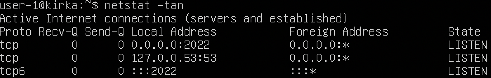

## Part 9. Установка и использование утилит **top**, **htop**

### Вывод команды **top**:
  - uptime `top - 16:38:36 up  1:23`
  - количество авторизованных пользователей `1 user`
  - общую загрузку системы `0.0`
  - общее количество процессов `109 total`
  - загрузку cpu `0.2`
  - загрузку памяти `197.8 MiB`
  - pid процесса занимающего больше всего памяти `644`
  - pid процесса, занимающего больше всего процессорного времени `644`

### Вывод команды **htop**:
  - сортировка по PID

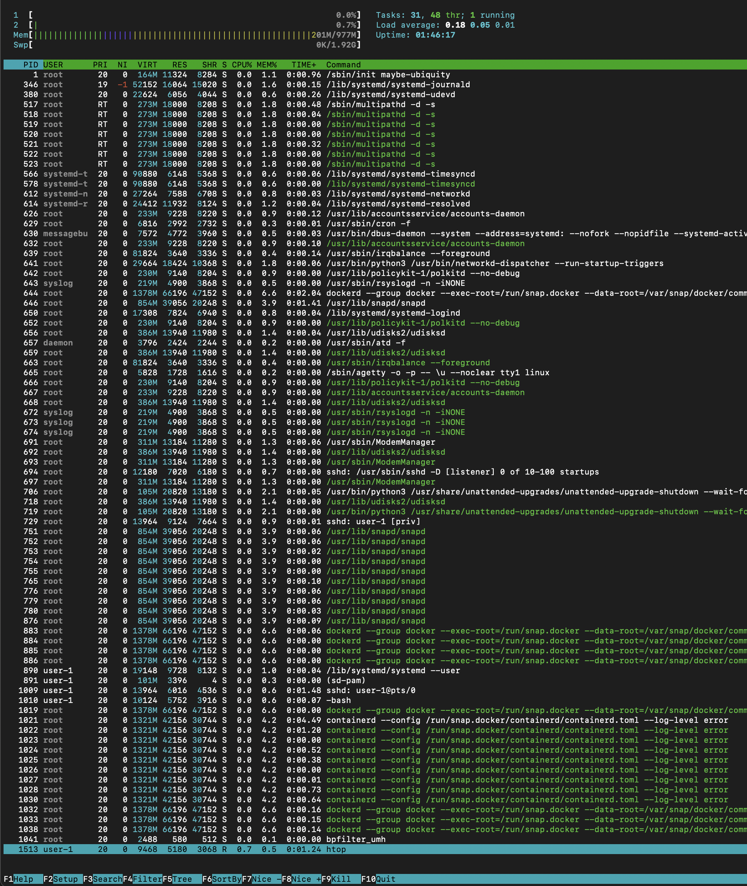
  - сортировка по PERCENT_CPU

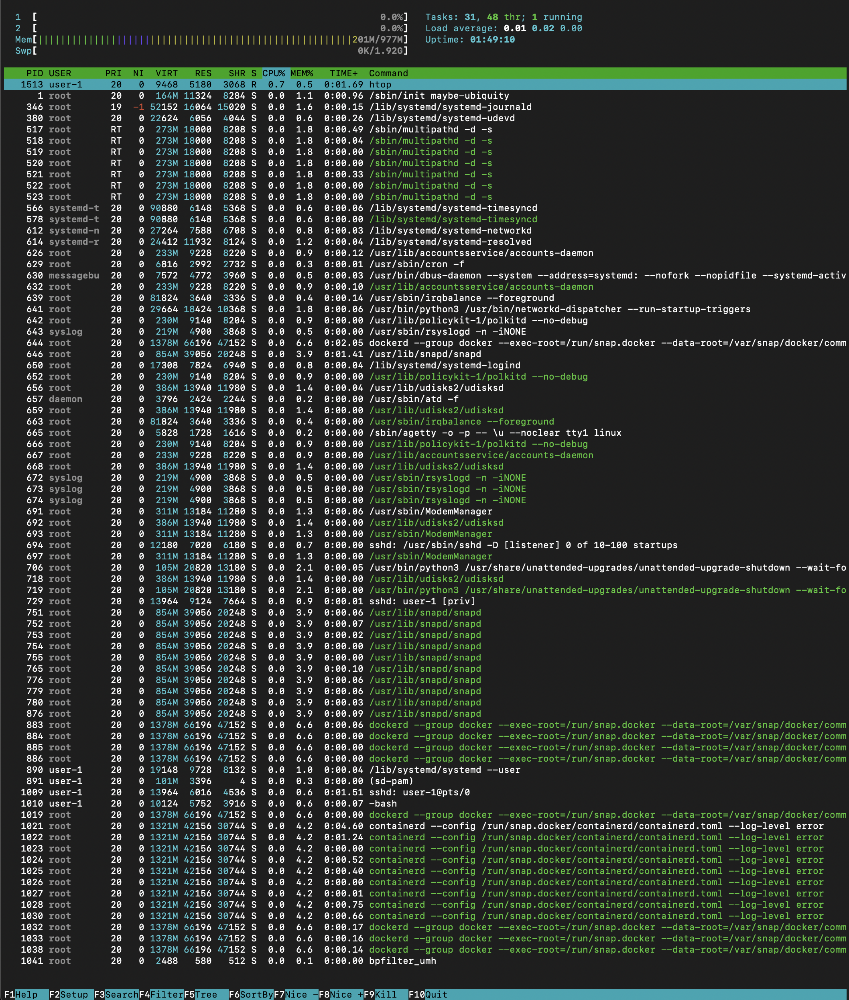
  - сортировка по PERCENT_MEM

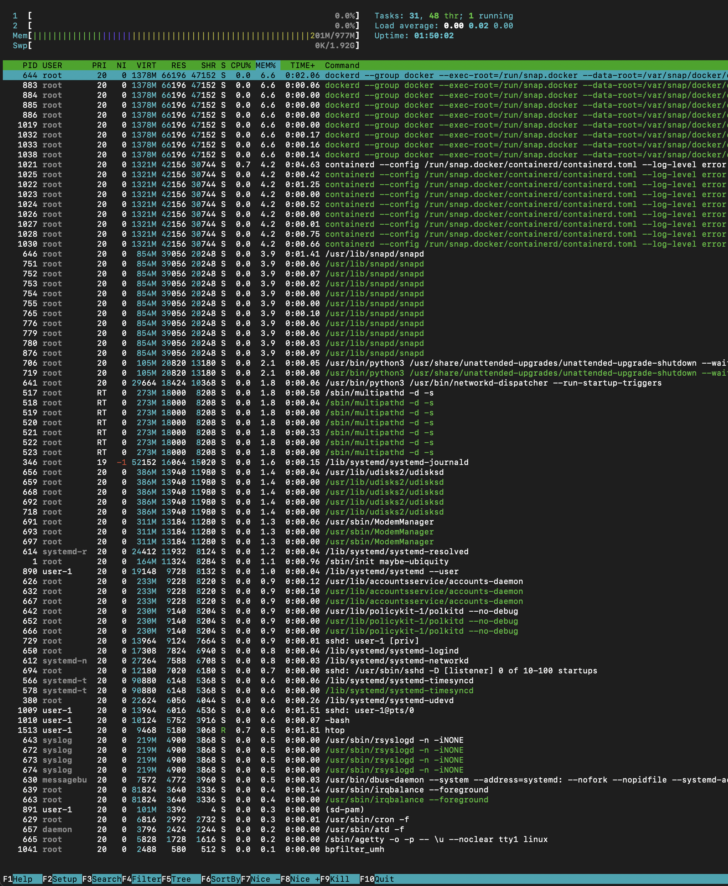
  - сортировка по TIME

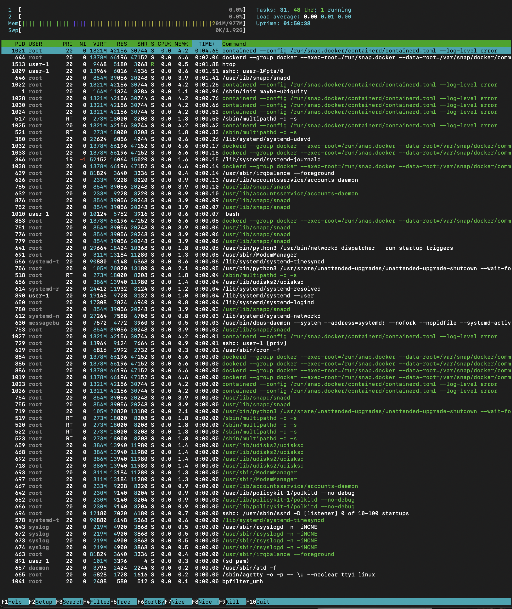
  - фильтр для процесса sshd

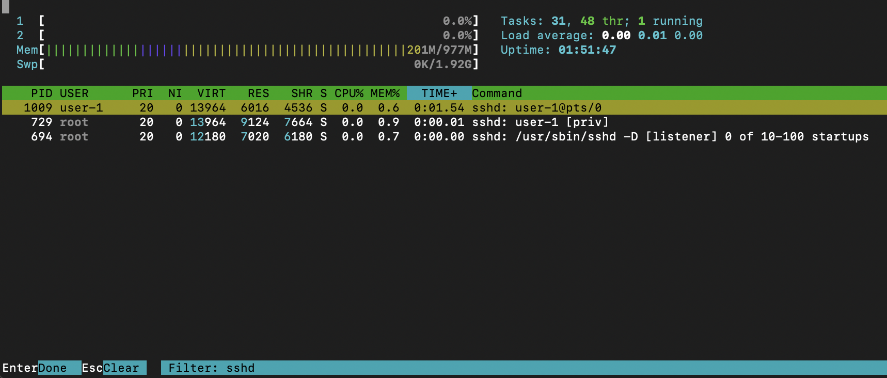
  - процесс syslog, найденный, используя поиск

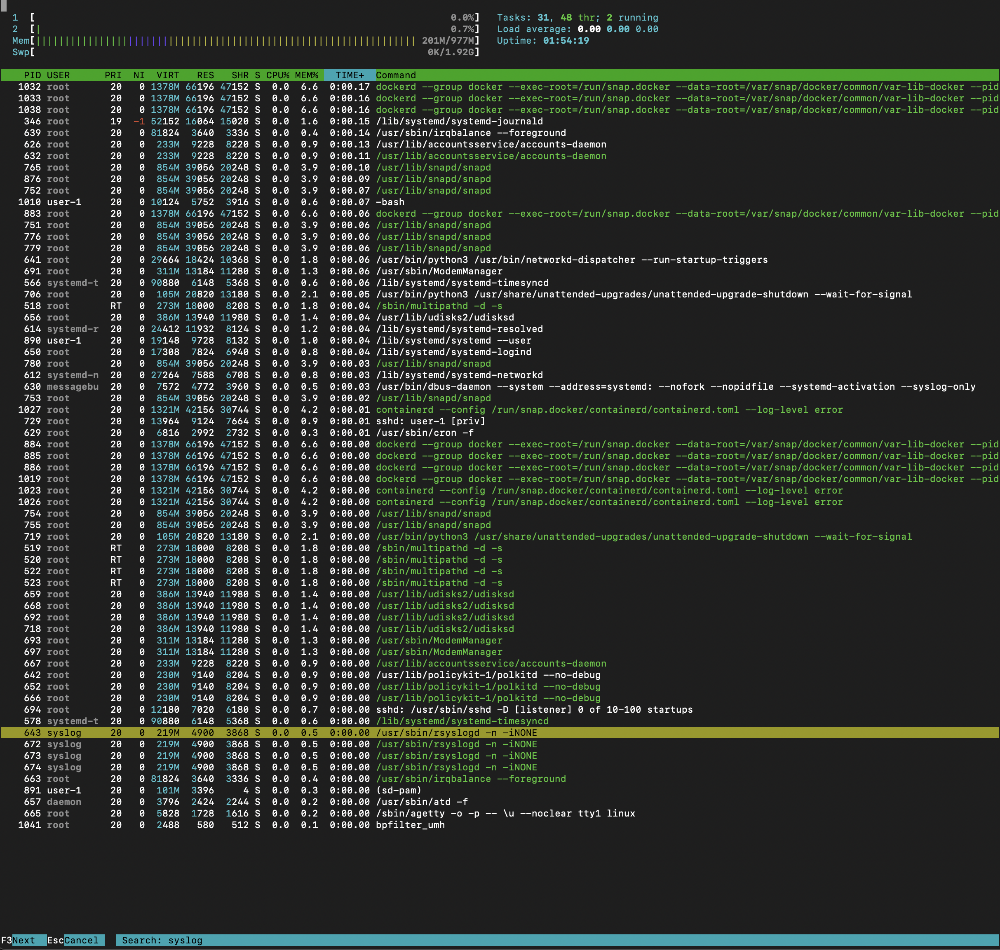
  - с добавленным выводом hostname, clock и uptime

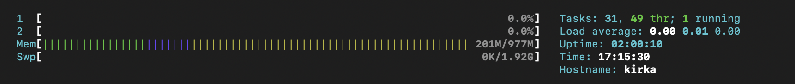

## Part 10. Использование утилиты **fdisk**

- название жесткого диска `/dev/sda`
- размер `16 GiB`
- количество секторов `33554432`
- swap `0`

## Part 11. Использование утилиты **df** 

### Запуск команды df
-  Для корневого раздела (/):
    - размер раздела `16400252`
    - размер занятого пространства `6302316`
    - размер свободного пространства `9242848`
    - процент использования `41`
- единица измерения в выводе `Килобайт`

### Запуск команды df -Th
- Для корневого раздела (/):
    - размер раздела `16G`
    - размер занятого пространства `6.1G`
    - размер свободного пространства `8.9G`
    - процент использования `41`
- Тип файловой системы для раздела `ext4`

## Part 12. Использование утилиты **du**

- размер папок `/home, /var, /var/log` (в байтах, в человекочитаемом виде)

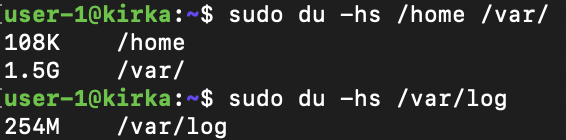

- размер всего содержимого в `/var/log/*`

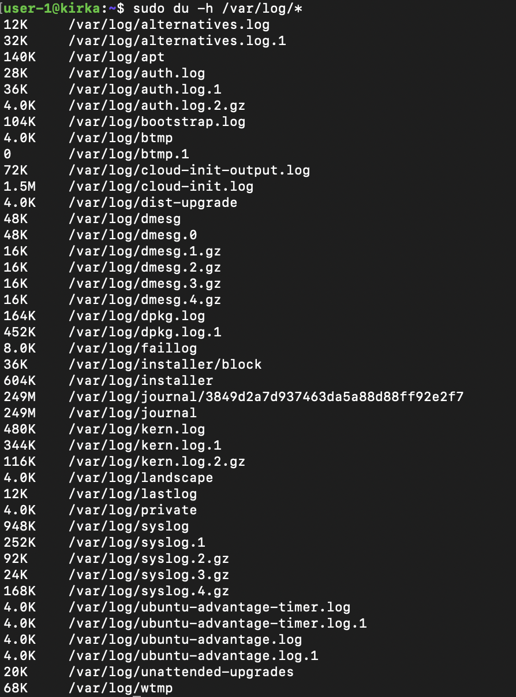

## Part 13. Установка и использование утилиты **ncdu**
- размер `/home`

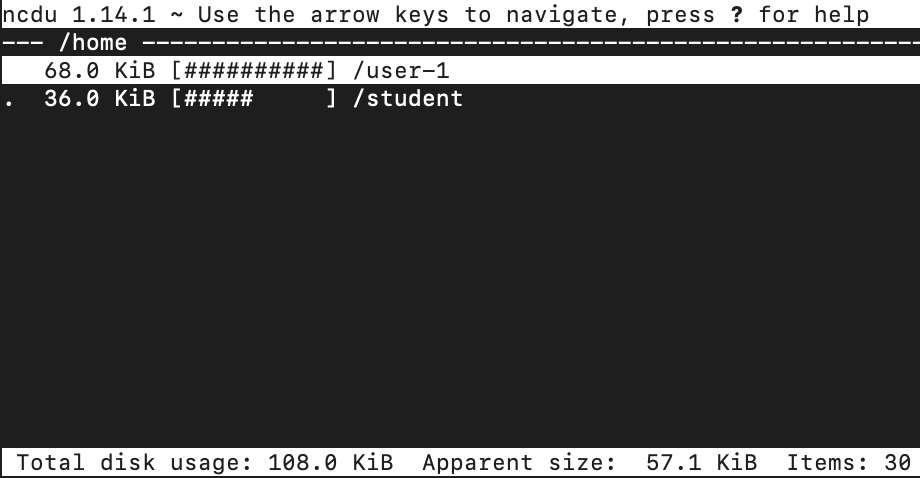
- размер `/var`

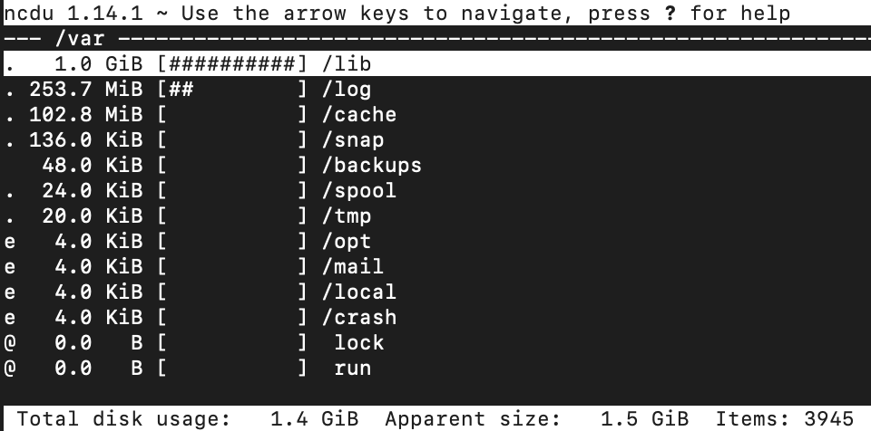
- размер `/var/log`

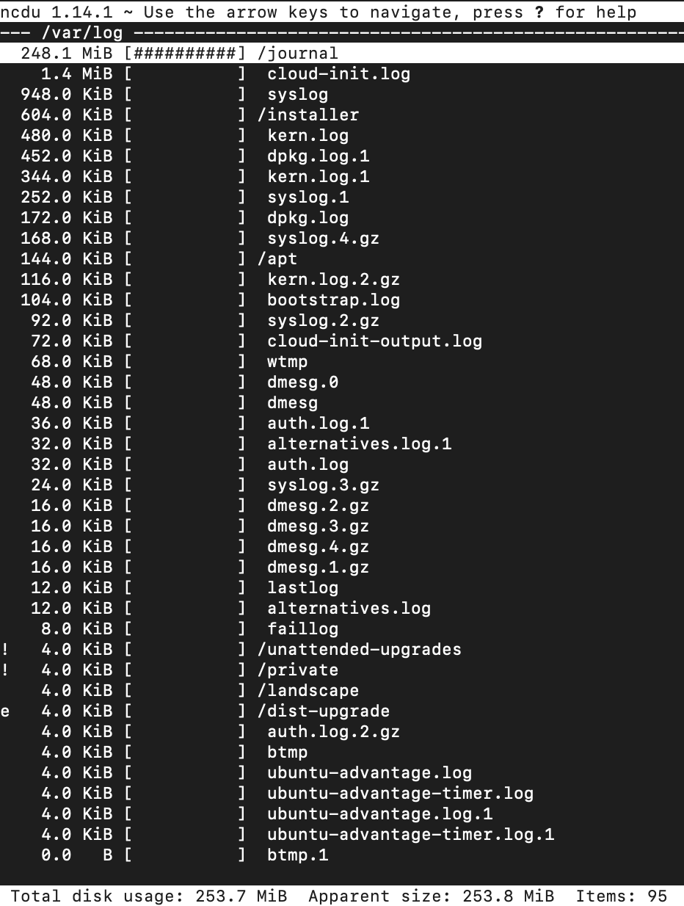

## Part 14. Работа с системными журналами

### **Последний успешный вход в систему**
- Feb 26 08:18:52 kirka sshd[1255]: Accepted password for user-1 from 10.0.2.2 port 64005 ssh2
- Feb 26 08:18:52 kirka sshd[1255]: pam_unix(sshd:session): session opened for user user-1 by (uid=0)
- Feb 26 08:18:52 kirka systemd-logind[651]: New session 4 of user user-1.

### **Перезагрузка sshd**
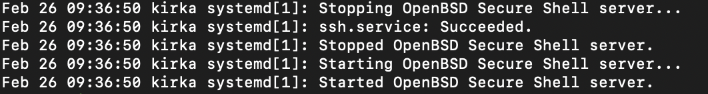

## Part 15. Использование планировщика заданий **CRON**

### Используя планировщик заданий, запустите команду uptime через каждые 2 минуты.
- в системном журанале `/var/log/syslog` записи о выполнении

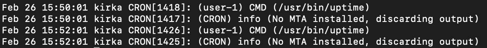
- вывести на экран список текущих заданий для CRON

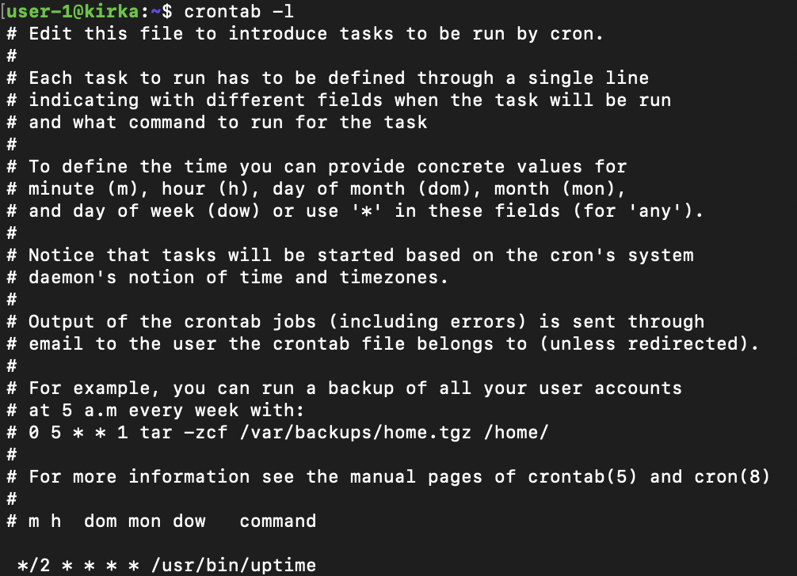
### Удалите все задания из планировщика заданий.

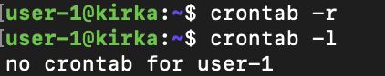
