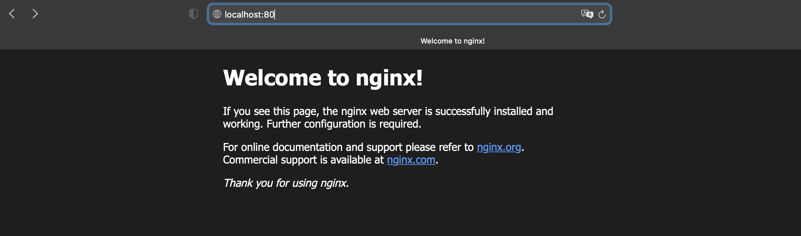
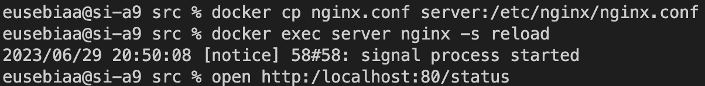

## Part 1. Готовый докер

В качестве конечной цели своей небольшой практики вы сразу выбрали написание докер образа для собственного веб сервера, а потому в начале вам нужно разобраться с уже готовым докер образом для сервера.
Ваш выбор пал на довольно простой **nginx**.

**== Выполение задания ==**

#### Взять официальный докер образ с **nginx** и выкачать его при помощи `docker pull`
  > 

#### Проверить наличие докер образа через `docker images`
#### Запустить докер образ через `docker run -d [image_id|repository]`
#### Проверить, что образ запустился через `docker ps`
  > 

#### Посмотреть информацию о контейнере через `docker inspect [container_id|container_name]`
#### ShmSize - это параметр, который устанавливает размер разделяемой области памяти (SHM), доступной для контейнера Docker
#### SizeRootFs - это параметр, который выводит размер корневой файловой системы (rootfs) контейнера или образа Docker
  > 

#### Cписок замапленных портов и ip контейнера
  > 

#### Остановить докер образ через `docker stop [container_id|container_name]`
#### Проверить, что образ остановился через `docker ps`
  > 

#### Запустить докер с портами 80 и 443 в контейнере, замапленными на такие же порты на локальной машине, через команду *run*
  > 

#### Проверить, что в браузере по адресу *localhost:80* доступна стартовая страница **nginx**
  > 

#### Перезапустить докер контейнер через `docker restart [container_id|container_name]`
#### Проверил, что контейнер запустился командой `docker ps`
  > 

## Part 2. Операции с контейнером

Докер образ и контейнер готовы. Теперь можно покопаться в конфигурации **nginx** и отобразить статус страницы.

**== Выполнение задания ==**

#### Прочитать конфигурационный файл *nginx.conf* внутри докер контейнера через команду *exec*
  > 

#### Создать на локальной машине файл *nginx.conf*
#### Настроить в нем по пути */status* отдачу страницы статуса сервера **nginx**
  > 

#### Скопировать созданный файл *nginx.conf* внутрь докер образа через команду `docker cp`
#### Перезапустить **nginx** внутри докер образа через команду *exec*
  > 

#### Проверить, что по адресу *localhost:80/status* отдается страничка со статусом сервера **nginx**
  > 

#### Экспортировать контейнер в файл *container.tar* через команду *export*
  > `docker export server -o container.tar`

#### Остановить контейнер -> `docker stop server`
  > 

#### Удалить образ через `docker rmi [image_id|repository]`, не удаляя перед этим контейнеры
  > 

#### Удалить остановленный контейнер
  > 

#### Импортировать контейнер обратно через команду *import*
  > 
#### Опция `-c 'CMD ["nginx", "-g", "daemon off;"]'` используется для запуска nginx в режиме не демона,
#### то есть в переднем плане, чтобы контейнер не останавливался сразу после запуска nginx

#### Запустить импортированный контейнер
  > 

#### Проверить, что по адресу *localhost:80/status* отдается страничка со статусом сервера **nginx**
  > 