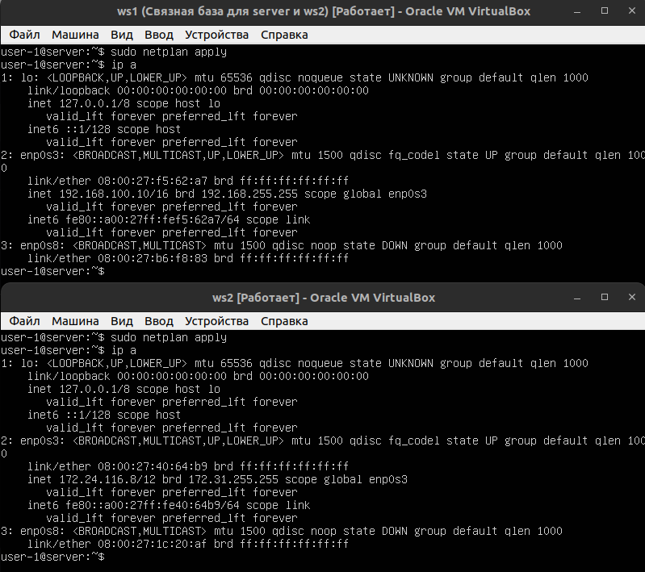
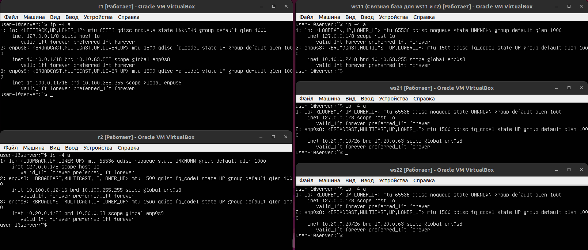
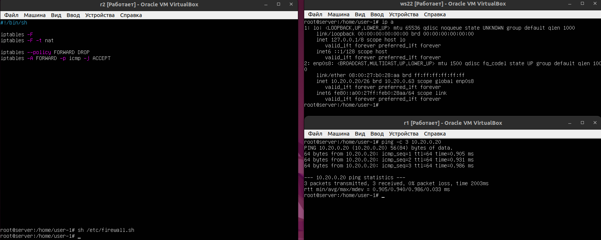

# Сети в Linux

## Part 1. Инструмент **ipcalc**

#### 1.1. Сети и маски

##### 1) адрес сети *192.167.38.54/13*  == *192.160.0.0/13*
##### 2) перевод масок:
  `-` *255.255.255.0* в префиксную == */24* и двоичную == *11111111.11111111.11111111.00000000*
  `-` */15* в обычную == *255.254.0.0* и двоичную == *11111111.11111110.00000000.00000000*
  `-` *11111111.11111111.11111111.11110000* в обычную == *255.255.255.240* и префиксную == */28*
##### 3) минимальный и максимальный хост в сети *12.167.38.4* при масках:
  `-` */8* == *12.0.0.1* и *12.255.255.254*
  `-` *11111111.11111111.00000000.00000000* == *12.167.0.1* и *12.167.255.254*
  `-` *255.255.254.0* == *12.167.38.1* и *12.167.39.254*
  `-` */4* == *0.0.0.1* и *15.255.255.254*

#### 1.2. localhost
##### Определить и записать в отчёт, можно ли обратиться к приложению, работающему на localhost, со следующими IP:
  `-` *194.34.23.100* == `нет`
  `-` *128.0.0.1* == `нет`
  `-` *127.0.0.2* == `да`
  `-` *127.1.0.1* == `да`

#### 1.3. Диапазоны и сегменты сетей
##### Определить и записать в отчёт:
##### 1) какие из перечисленных IP можно использовать в качестве публичного, а какие только в качестве частных:
 `-` публичные: *134.43.0.2*, *172.0.2.1*, *192.172.0.1*, *172.68.0.2*, *192.169.168.1*
 `-` частные: *10.0.0.45*, *172.20.250.4*, *192.168.4.2*, *10.10.10.10*, *172.16.255.255*

##### 2) какие из перечисленных IP адресов шлюза возможны у сети *10.10.0.0/18*:
 `-` возможны: *10.10.0.2*, *10.10.10.10*, *10.10.1.255*
 `-` невозможны: *10.0.0.1*, *10.10.100.1*

## Part 2. Статическая маршрутизация между двумя машинами

##### Поднять две виртуальные машины (далее -- ws1 и ws2)

##### С помощью команды `ip a` посмотреть существующие сетевые интерфейсы

- Cкрин с вызовом и выводом использованной команды.


##### Описать сетевой интерфейс, соответствующий внутренней сети, на обеих машинах и задать следующие адреса и маски:

ws1 - *192.168.100.10*, маска */16*, ws2 - *172.24.116.8*, маска */12*

- Cкрины с содержанием изменённого файла *etc/netplan/00-installer-config.yaml* для каждой машины.


##### Выполнить команду `netplan apply` для перезапуска сервиса сети
- Cкрин с вызовом и выводом использованной команды.



#### 2.1. Добавление статического маршрута вручную
##### Статический маршрут от одной машины до другой, обратно и проверка пингованием


#### 2.2. Добавление статического маршрута с сохранением

##### Добавлен статический маршрут от одной машины до другой с помощью файла *etc/netplan/00-installer-config.yaml*
- В отчёт поместить скрин с содержанием изменённого файла *etc/netplan/00-installer-config.yaml*.


##### Пингование соединения между машинами


## Part 3. Утилита **iperf3**

#### 3.1. Скорость соединения
##### Перевести и записать в отчёт: 8 Mbps в MB/s, 100 MB/s в Kbps, 1 Gbps в Mbps
 `-` 8 Mbps == 1 MB/s
 `-` 100 MB/s == 819200 Kbps
 `-` 1 Gbps == 1024 Mbps

#### 3.2. Утилита **iperf3**
##### Cкорость соединения между ws1 и ws2


## Part 4. Сетевой экран

#### 4.1. Утилита **iptables**
##### Создан файл */etc/firewall.sh*, имитирующий фаерволл, на ws1 и ws2. В файл добавлены подряд следующие правила:
##### 1) на ws1 применить стратегию когда в начале пишется запрещающее правило, а в конце пишется разрешающее правило (это касается пунктов 4 и 5)
##### 2) на ws2 применить стратегию когда в начале пишется разрешающее правило, а в конце пишется запрещающее правило (это касается пунктов 4 и 5)
##### 3) открыть на машинах доступ для порта 22 (ssh) и порта 80 (http)
##### 4) запретить *echo reply* (машина не должна "пинговаться”, т.е. должна быть блокировка на OUTPUT)
##### 5) разрешить *echo reply* (машина должна "пинговаться")
- Содержание файла */etc/firewall* для каждой машины


- Запуск


- Машина ws1 не пингуется, в отличии от ws2. В файле машины ws1 запрещающее правило прописано первым, а ws2 вторым. Следовательно, это паказывает, запрещающие правила не перезаписываются.

#### 4.2. Утилита **nmap**
##### Командой **ping** нашли машину ws1, которая не "пингуется", после чего утилитой **nmap** показано, что хост машины запущен


<!-- ##### Сохранить дампы образов виртуальных машин
**p.s. Ни в коем случае не сохранять дампы в гит!** -->


## Part 5. Статическая маршрутизация сети

Сеть:


#### 5.1. Настройка адресов машин
##### Настроил конфигурации машин в *etc/netplan/00-installer-config.yaml* согласно сети на рисунке:


##### Перезапустил сервис сети командой `netplan apply`
##### Командой `ip -4 a` проверил, что адрес машины задан верно:



##### Пропинговал ws22 с ws21 и r1 с ws11:


#### 5.2. Включение переадресации IP-адресов.
##### Для включения переадресации IP, выполнил команду на роутерах:
`sysctl -w net.ipv4.ip_forward=1`
*При таком подходе переадресация не будет работать после перезагрузки системы.*


##### Открыл файл */etc/sysctl.conf* и добавил в него следующую строку:
`net.ipv4.ip_forward = 1`


*При использовании этого подхода, IP-переадресация включена на постоянной основе.*

#### 5.3. Установка маршрута по-умолчанию
##### Настроил маршрут по-умолчанию (шлюз) для рабочих станций:


##### Вызвал `ip r` чтобы показать, что добавился маршрут в таблицу маршрутизации:


##### Пропинговал с ws11 роутер r2 и продемонстрировать на r2, что пинг доходит. Для этого использовал команду:
`tcpdump -tn -i enp0s9`


#### 5.4. Добавление статических маршрутов
##### Добавил в роутеры r1 и r2 статические маршруты в файле конфигураций:


##### Вызвал `ip r` чтобы показать таблицы с маршрутами на обоих роутерах:


##### Запустил команды `ip r list 10.10.0.0/[маска сети]` и `ip r list 0.0.0.0/0` на ws11:


Маршрут подбирается по таблице марштрутизаторов. Если маршрут выбран успешно то он будет передан. Если не успешно - пакет не будет передан.
Если есть два и более маршрутов на одну и ту же сеть, то маршрутизация осуществляется по принципу наибольшего совпадения маски.

#### 5.5. Построение списка маршрутизаторов
##### На r1 запустил команду дампа:
`tcpdump -tnv -i enp0s8`
##### При помощи утилиты **traceroute** построил список маршрутизаторов на пути от ws11 до ws21


`Traceroute` фиксирует адрес маршрутизатора, а также время между отправкой пакета, которых отправляется сразу три, и получением ответа. Затем `traceroute` повторяет отправку пакета, но уже с увеличенным на единицу TTL, что позволяет первому маршрутизатору пропустить пакет дальше. Процесс повторяется до тех пор, пока пакет не достигнет целевого узла.
`traceroute` выполняет отправку данных указанному узлу сети, при этом отображая сведения о всех промежуточных маршрутизаторах, через которые прошли данные на пути к целевому узлу. В случае проблем при доставке данных до какого-либо узла программа позволяет определить, на каком именно участке сети возникли неполадки.

#### 5.6. Использование протокола **ICMP** при маршрутизации
##### Запустил на r1 перехват сетевого трафика, проходящего через enp0s8 с помощью команды:
`tcpdump -n -i enp0s8 icmp`
##### И пропинговал с ws11 несуществующий IP *10.30.0.111*


## Part 6. Динамическая настройка IP с помощью **DHCP**

*В данном задании используются виртуальные машины из Части 5*

##### Для r2 настроил в файле */etc/dhcp/dhcpd.conf* конфигурацию службы **DHCP**:

##### Указал MAC адрес у ws11:


##### Указал адрес маршрутизатора по-умолчанию, DNS-сервер и адрес внутренней сети. Для r1 настроил выдачу адресов с жесткой привязкой к MAC-адресу (ws11):


##### В файле *resolv.conf* прописал `nameserver 8.8.8.8`:


##### Перезагрузил службу **DHCP** командой `systemctl restart isc-dhcp-server`. Машину ws21 перезагрузил при помощи `reboot` и через `ip a` показал, что она получила адрес. Также пропинговал ws22.


##### Запросил с ws21 обновление ip адреса. ip до и после обновления.


Если необходимо освободить IP адрес который был получен у DHCP-сервера и получить новый, используйте:
```shell
sudo dhclient -r  # Флаг -r явно освобождает текущую аренду, 
                  # как только аренда освобождается, клиент завершает работу.
sudo dhclient     # Заново запускает работу DHCP-клиента
```

## Part 7. **NAT**

##### В файле */etc/apache2/ports.conf* на ws22 и r1 изменил строку `Listen 80` на `Listen 0.0.0.0:80`, то есть сделал сервер Apache2 общедоступным


##### Запустил веб-сервер Apache командой `service apache2 start` на ws22 и r1


##### Добавил в фаервол, созданный по аналогии с фаерволом из Части 4, на r2 следующие правила:
##### 1) удаление правил в таблице filter - `iptables -F`
##### 2) удаление правил в таблице "NAT" - `iptables -F -t nat`
##### 3) отбрасывать все маршрутизируемые пакеты - `iptables --policy FORWARD DROP`
##### Запускать файл также, как в Части 4
##### Проверить соединение между ws22 и r1 командой `ping`
*При запуске файла с этими правилами, ws22 не должна "пинговаться" с r1*


##### Добавил в файл ещё одно правило:
##### 4) разрешить маршрутизацию всех пакетов протокола **ICMP**
##### Запустил файл также, как в Части 4
##### Проверил соединение между ws22 и r1 командой `ping`
*При запуске файла с этими правилами, ws22 должна "пинговаться" с r1*



##### Добавил в файл ещё два правила:
##### 5) включил **SNAT**, а именно маскирование всех локальных ip из локальной сети, находящейся за r2 (по обозначениям из Части 5 - сеть 10.20.0.0)
*Совет: стоит подумать о маршрутизации внутренних пакетов, а также внешних пакетов с установленным соединением*
##### 6) включил **DNAT** на 8080 порт машины r2 и добавить к веб-серверу Apache, запущенному на ws22, доступ извне сети
*Совет: стоит учесть, что при попытке подключения возникнет новое tcp-соединение, предназначенное ws22 и 80 порту*


##### Запускать файл также, как в Части 4
*Перед тестированием рекомендуется отключить сетевой интерфейс **NAT** (его наличие можно проверить командой `ip a`) в VirtualBox, если он включен*
##### Проверить соединение по TCP для **SNAT**, для этого с ws22 подключиться к серверу Apache на r1 командой:
`telnet 10.100.0.11 80` (обращаться по адресу r1 и порту Apache)

##### Проверить соединение по TCP для **DNAT**, для этого с r1 подключиться к серверу Apache на ws22 командой `telnet 10.100.0.12 8080` (обращаться по адресу r2 и порту 8080)


## Part 8. Дополнительно. Знакомство с **SSH Tunnels**

##### Запустить на r2 фаервол с правилами из Части 7
##### Запустить веб-сервер **Apache** на ws22 только на localhost (то есть в файле */etc/apache2/ports.conf* изменить строку `Listen 80` на `Listen localhost:80`)


##### Воспользоваться *Local TCP forwarding* с ws21 до ws22, чтобы получить доступ к веб-серверу на ws22 с ws21

##### Воспользовался командой `ssh -L [local_port]:localhost:[local_port] [remote_host]`


##### Воспользоваться *Remote TCP forwarding* c ws11 до ws22, чтобы получить доступ к веб-серверу на ws22 с ws11

##### Воспользовался командой `ssh -R [local_port]:localhost:[local_port] [remote_host]`


##### Для проверки, сработало ли подключение в обоих предыдущих пунктах, перейдите во второй терминал (например, клавишами Alt + F2) и выполните команду:
`telnet 127.0.0.1 [локальный порт]`


